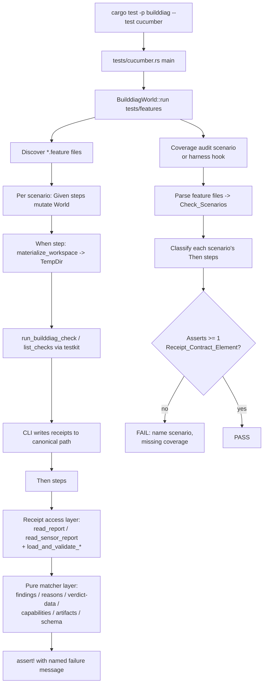
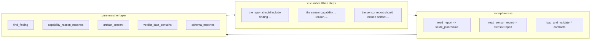

# Design Document

## Overview

This feature tightens the builddiag BDD/cucumber suite so that every scenario which runs
`builddiag check` asserts the full receipt contract — `builddiag.report.v1` report payloads and
`sensor.report.v1` envelopes — rather than only the process exit code and the top-level verdict.
It also extends the reusable cucumber step library with the small number of missing, expressive,
DRY steps required to make those assertions readable and shared, and it adds a deterministic
coverage audit that fails the suite if any check scenario stops at exit code and top-level verdict.

The scope is strictly test-only. The work touches three artifact groups, all under
`crates/builddiag-cli/tests/`:

- **Feature files** (`tests/features/*.feature`) — add receipt-contract assertions to each
  `builddiag check` scenario.
- **Step library** (`tests/bdd/steps.rs`) — add the few missing steps and refactor matching logic
  into pure, reusable, property-testable helpers.
- **Harness** (`tests/bdd/{world.rs,helpers.rs,mod.rs}`, `tests/cucumber.rs`) — add a coverage
  audit and supporting helpers.

No runtime behavior, no check logic, and no JSON schema changes are in scope. The design reuses the
existing `builddiag-output-contract` load/validate functions and `builddiag-types` structs, and it
keeps all test-only dependencies confined to the builddiag CLI crate's `[dev-dependencies]`.

### Goals

- Every `builddiag check` scenario asserts at least one Receipt_Contract_Element beyond exit code
  and top-level verdict.
- Every failing-verdict scenario asserts the specific Finding (check id, code, severity) that drives
  the failure.
- Every sensor-emitting scenario asserts at least one of: a Verdict_Reason, a Verdict_Data entry, a
  Capability_State, or an Artifact_Entry, in addition to the sensor verdict status.
- Receipt assertions are exposed once each, as shared steps, with no duplicated matching logic.
- Matching is order-independent and stable against volatile fields (timestamps, host identity,
  absolute paths) so results are deterministic across runs and scenario orderings.

### Non-Goals

- Changing builddiag runtime behavior, check implementations, or output writers.
- Changing the `builddiag.report.v1` or `sensor.report.v1` schemas or the contracts crate.
- Adding new runtime dependencies to any workspace crate.

## Architecture

The harness flow is unchanged in shape: `tests/cucumber.rs` runs `BuilddiagWorld::run("tests/features")`,
which discovers every `*.feature` file, materializes a real `TempDir` workspace per scenario from the
`BuilddiagWorld` state, runs the CLI through `builddiag_testkit::cli::builddiag_command()`, and then
evaluates `Then` steps against the receipts written to the canonical report path.

This design inserts a **pure matcher layer** between the cucumber `Then` steps and the parsed
receipts, and adds a **coverage audit** that runs as part of the same test binary.



### Layering rationale

The current `steps.rs` mixes JSON/DTO navigation and assertion directly inside each `#[then]`
function. To satisfy Requirement 6 (DRY, single definition per assertion) and Requirements 6.5 / 8.2
/ 8.3 / 8.7 (order-independent, deterministic, volatile-field-invariant matching), the matching
logic is extracted into small **pure functions** that take parsed receipt data and a query and
return a `Result<(), String>` (Ok on match, Err carrying a precise, named failure message). The
cucumber `#[then]` wrappers become thin: resolve the receipt at the canonical path, call the matcher,
and `unwrap`/`assert` the result. This makes the matchers directly unit- and property-testable
without spinning up the CLI.



## Components and Interfaces

### Existing components (reused unchanged)

- `BuilddiagWorld` (`world.rs`): per-scenario state and accessors `workspace_path()`, `exit_code()`,
  `stdout()`, `stderr()`. No new state is required for the matcher work; the coverage audit reads
  feature files from disk and does not need World state.
- `helpers.rs`: `materialize_workspace`, `run_builddiag_check`, `run_builddiag_list_checks`. Reused
  as-is.
- `canonical_report_path(world)` (`steps.rs`): resolves the on-disk receipt path with precedence
  `artifacts_dir_override` → `explicit_out` → `out_dir_override` → default
  `artifacts/builddiag/report.json`. Reused as the single resolution point for Requirement 6.2.
- `builddiag-output-contract`: `load_and_validate_builddiag_report`, `load_and_validate_sensor_report`,
  `load_sensor_report`. Reused for schema validation (Requirement 6.4) and typed access.
- `builddiag-types`: `Report`, `SensorReport`, `Finding`, `SensorVerdict`, `VerdictStatus`,
  `Capability`, `CapabilityStatus`, `Artifact`. Reused for typed matching.

### Step library: existing steps mapped to requirements

The following steps already exist and satisfy their requirements; they are retained:

| Step | Satisfies |
| --- | --- |
| `the report should include finding {} {} {}` | Req 1.3 |
| `the report should not include finding {} {}` | Req 1.4 |
| `the report should not include any {} findings` | Req 1.2 |
| `the report verdict should be {}` / `the report should have verdict {}` | top-level verdict |
| `the report should exist at the canonical path` | Req 6.2/6.4 (validates report incl. schema) |
| `the sensor report should exist at the canonical path` | Req 6.2/6.4 (validates sensor incl. schema) |
| `the sensor report verdict status should be {}` | Req 2.1 |
| `the sensor report verdict should include reason {}` | Req 2.6 |
| `the sensor report verdict data should include {} in {}` | Req 2.7 |
| `the sensor report should include capabilities {}` | Req 3.2 |
| `the sensor capability {} should be {}` | Req 3.3 |
| `the sensor report should include artifact {} at {}` | Req 4.3 |
| `the file {} should have schema {}` | Req 5.3 (embedded payload), Req 5.4 (arbitrary path) |

### Step library: gap analysis (what is missing or needs improvement)

1. **Capability reason assertion (Req 3.4) — MISSING.** No step asserts a capability's `reason`
   exact full-string match. New step required:
   `the sensor capability {string} reason should be {string}`.

2. **Schema identifier for the receipt at the canonical path (Req 5.1, 5.2) — PARTIAL.** Schema is
   validated implicitly inside `load_and_validate_*`, but there is no explicit, addressable
   assertion of the schema string against `builddiag.report.v1` / `sensor.report.v1` at the
   canonical path. The existing `the file {} should have schema {}` requires a literal path and is
   used for the embedded payload (Req 5.3). Two new canonical-path steps are required:
   `the report schema should be {string}` and `the sensor report schema should be {string}`. Both
   resolve via `canonical_report_path` (Req 6.2) and emit a message naming the resolved path, the
   expected schema, and the actual value (Req 5.5).

3. **Failure-message precision (Req 1.5, 1.6, 2.8, 3.5, 3.6, 3.7, 4.5, 4.6, 5.5) — NEEDS
   IMPROVEMENT.** Current panic messages are close but do not all satisfy the "name X" criteria:
   - `the report should include finding` message names check_id/code/severity ✓ (Req 1.5 met).
   - `the report should not include finding` names check_id/code ✓ (Req 1.6 met).
   - `the sensor capability {} should be {}` message names capability + expected, but **not the
     recorded status** (Req 3.6 requires naming the recorded status). Improve the message to include
     the actual recorded status.
   - `the sensor report should include capabilities {}` names the missing capability ✓ (Req 3.5).
   - `the sensor report verdict data should include {} in {}` panics with separate messages for
     "data absent", "field not an array", and "value absent". Consolidate into one message naming
     the expected check id and the targeted field, covering the absent-data/absent-field branches
     (Req 2.8).
   - `the sensor report should include artifact {} at {}` names expected name + path ✓ (Req 4.5), but
     there is **no file-existence assertion** at the resolved path (Req 4.2, 4.6).

4. **Artifact-file existence relative to the sensor report directory (Req 4.2, 4.6) — MISSING.**
   Today scenarios assert the file with a separate literal-path `the file {} should exist`. Req 4.2
   wants the file resolved relative to the directory containing the sensor report. New step:
   `the sensor artifact {string} file should exist`, which looks up the artifact by name in the
   sensor report, resolves its `path` against the sensor report's directory, and asserts existence,
   emitting a message naming the artifact name and the resolved path (Req 4.6).

5. **Receipt-not-found and schema-validation-failure messaging (Req 6.3, 6.4) — NEEDS
   IMPROVEMENT.** `read_report`/`read_sensor_report` currently panic with a generic message and do
   not validate schema before payload assertions. The receipt access layer is reworked so that any
   payload assertion first resolves the canonical path and loads-and-validates; a missing file
   yields a "receipt not found at <path>" message (Req 6.3) and a schema-invalid receipt yields a
   message naming the path and the validation error (Req 6.4).

6. **Order-independent matching (Req 6.5) — ALREADY SATISFIED, to be preserved.** All matchers scan
   `Vec`/`BTreeMap` for a member satisfying the identifying fields; none rely on positional indices.
   Extracting them as pure functions and property-testing order-independence locks this in.

### Step library: final step inventory

New or modified steps (all matching logic delegated to the pure matcher layer):

- `the report schema should be {string}` (new) — Req 5.1.
- `the sensor report schema should be {string}` (new) — Req 5.2.
- `the sensor capability {string} reason should be {string}` (new) — Req 3.4, 3.7.
- `the sensor artifact {string} file should exist` (new) — Req 4.2, 4.6.
- `the sensor capability {} should be {}` (modified message) — Req 3.6.
- `the sensor report verdict data should include {} in {}` (modified message) — Req 2.8.
- Receipt access layer reworked for not-found / schema-invalid messaging — Req 6.3, 6.4.

### Pure matcher layer interface

A new module `tests/bdd/matchers.rs` (declared in `mod.rs`) holds pure functions over parsed
receipts. Each returns `Result<(), String>` where `Err` carries the exact named failure message the
step will surface. Signatures (illustrative):

```rust
// Findings (operate on the report's findings array as typed or serde_json values)
pub fn assert_finding_present(findings: &[FindingView], check_id: &str, code: &str, severity: &str)
    -> Result<(), String>;
pub fn assert_finding_absent(findings: &[FindingView], check_id: &str, code: &str)
    -> Result<(), String>;
pub fn assert_no_error_findings(findings: &[FindingView]) -> Result<(), String>;

// Sensor verdict
pub fn assert_reason_present(reasons: &[String], token: &str) -> Result<(), String>;
pub fn assert_verdict_data_contains(data: Option<&serde_json::Value>, field: &str, check_id: &str)
    -> Result<(), String>;

// Capabilities
pub fn assert_capability_present(caps: &BTreeMap<String, Capability>, name: &str)
    -> Result<(), String>;
pub fn assert_capability_status(caps: &BTreeMap<String, Capability>, name: &str, status: &str)
    -> Result<(), String>;
pub fn assert_capability_reason(caps: &BTreeMap<String, Capability>, name: &str, reason: &str)
    -> Result<(), String>;

// Artifacts
pub fn assert_artifact_present(artifacts: &[Artifact], name: &str, path: &str)
    -> Result<(), String>;
pub fn resolve_artifact_path(sensor_report_path: &Path, artifacts: &[Artifact], name: &str)
    -> Result<PathBuf, String>;

// Schema
pub fn assert_schema(value: &serde_json::Value, expected: &str, source_path: &Path)
    -> Result<(), String>;
```

`FindingView` is a tiny `(check_id, code, severity)` projection so the same matcher works whether the
caller has a typed `Finding` or a `serde_json::Value`; this keeps the report-side (serde_json) and
sensor-side (typed) callers sharing one matcher and avoids duplicated logic (Req 6.1).

### Coverage audit component

The coverage audit (Requirement 7) is implemented as a **deterministic meta-test** that runs inside
the same `cucumber` test binary. Two implementation options were considered:

- **Option A — Tag convention + per-scenario manual review.** Rejected: relies on human discipline,
  drifts over time, and does not satisfy Req 7.4's automated failure.
- **Option B — Feature-file parsing audit (recommended).** A pure function parses every
  `tests/features/*.feature` file, identifies each `Check_Scenario` (a scenario whose `When` step
  invokes `builddiag check`, including `Background` steps), and classifies its `Then` steps to
  determine whether at least one Receipt_Contract_Element is asserted. This is deterministic, has no
  flakiness (it reads static files, runs no CLI), and produces a precise failure naming the
  offending scenario (Req 7.4).

The audit is wired in as a dedicated scenario in a new `tests/features/receipt_coverage_audit.feature`
with steps `When I audit all feature files for receipt-contract coverage` / `Then every check
scenario should assert a receipt-contract element`, OR — to avoid the audit auditing itself and to
keep it independent of World state — as a standalone `#[test]` is not possible under
`harness = false`. Therefore the audit runs as a cucumber scenario that does not run the CLI and is
explicitly excluded from the Check_Scenario set (it has no `builddiag check` When step).

Classification rules (Check_Scenario detection and element detection) are pure string/AST analysis:

- **Check_Scenario**: effective steps (Background + Scenario) contain a `When` matching
  `I run builddiag check` (any variant). Scenarios whose only `When` is `list-checks` are excluded.
- **Receipt_Contract_Element assertion**: any `Then`/`And` step matching one of the known
  receipt-assertion step phrases — finding present/absent, no-error-findings, verdict reason,
  verdict data, capability present/status/reason, artifact present, artifact file exists, report
  schema, sensor report schema, embedded-payload schema (`the file {} should have schema {}`),
  forward-slash findings. Steps that only assert exit code, top-level verdict, generic file
  existence, or stdout are **not** counted.
- **Failing-verdict refinement (Req 7.2)**: if a scenario asserts a failing top-level verdict
  (`verdict should be "fail"`/`"error"` or exit code 2), it must also assert a specific Finding
  (finding-present step). Otherwise the audit fails naming the scenario.
- **Sensor refinement (Req 7.3)**: if a scenario emits a Sensor_Report (asserts sensor existence or
  uses `output format "sensor"` / `check mode "cockpit"`), it must assert at least one of a verdict
  reason, verdict-data entry, capability state, or artifact entry in addition to status.

The classifier is exposed as pure functions in `matchers.rs` (or a sibling `coverage.rs`) so it can
be property-tested for order-independence (Req 7 maps onto the order-independence theme).

## Data Models

No new persisted data models are introduced. The test code consumes existing receipt structures.
Relevant shapes (from `builddiag-types`, unchanged):

- **Report** (`builddiag.report.v1`): `schema: String`, `verdict: String`, `findings: Vec<Finding>`,
  `summary`, `run`, `tool`. Read as `serde_json::Value` on the report side.
- **Finding**: `check_id: String`, `code: String`, `severity` (`info` | `warn` | `error`),
  optional `location { path }`.
- **SensorReport** (`sensor.report.v1`): `schema: String`, `verdict: SensorVerdict`,
  `run: Option<SensorRunInfo>` with `capabilities: BTreeMap<String, Capability>`,
  `artifacts: Vec<Artifact>`, `findings: Vec<SensorFinding>`.
- **SensorVerdict**: `status: VerdictStatus` (`pass` | `warn` | `fail` | `skip`),
  `reasons: Vec<String>`, `data: Option<serde_json::Value>` (array fields such as `failed_checks`,
  `warned_checks`).
- **Capability**: `status: CapabilityStatus` (`available` | `unavailable` | `skipped`),
  `reason: Option<String>`.
- **Artifact**: `name: String`, `path: String` (relative to the report directory),
  `mime_type: Option<String>`.

Test-internal model types:

- **FindingView { check_id, code, severity }** — projection used by the shared finding matcher.
- **CheckScenario { feature, name, when_runs_check: bool, emits_sensor: bool, expects_failure: bool,
  asserted_elements: Set<ElementKind> }** — produced by the coverage parser.
- **ElementKind** — enum: `Finding`, `VerdictReason`, `VerdictData`, `CapabilityState`,
  `ArtifactEntry`, `SchemaIdentifier`, `ForwardSlashFindings`.

### Canonical identifiers used by assertions (grounded in the current suite)

- **Check ids / codes / severities**: `rust.msrv_defined`/`missing_msrv`/`error`;
  `rust.toolchain_pinning`/`missing_toolchain`/`error`; `rust.toolchain_pinning`/`unpinned_channel`/`error`;
  `rust.toolchain_msrv_relation`/`toolchain_msrv_mismatch`/`error`;
  `tools.checksums_file_exists`/`missing_checksums`/`error`;
  `workspace.publish_ready`/`missing_description`/`error`; `workspace.publish_ready`/`missing_license`/`error`;
  `rust.edition_deprecations`/`deprecated_edition`/`error`;
  `deps.duplicate_versions`/`duplicate_dependency_version`/`error`;
  `deps.lockfile_present`/`missing_lockfile_for_binary`/`error`; `tool.runtime`/`runtime_error`/`error`.
- **Capabilities**: `git`, `config`, `toolchain`, `checksums`, `diff_aware`.
- **Verdict reasons**: `checks_failed`, `checks_warned`, `all_checks_skipped`, `tool_error`.
- **Verdict-data array fields**: `failed_checks`, `warned_checks`.
- **Schema identifiers**: `builddiag.report.v1`, `sensor.report.v1`.
- **Artifacts**: `payload` at `extras/payload.json`, `comment` at `comment.md`.

## Per-Feature-File Assertion Plan

Each `builddiag check` scenario gains the receipt-contract assertions listed below. All scenarios
already assert `the report should exist at the canonical path` (which loads-and-validates) and the
top-level verdict; the additions make the contract explicit and satisfy Req 5 and Req 7.

### msrv_validation.feature

- Failing scenarios already assert `report should include finding "rust.msrv_defined" "missing_msrv"
  "error"` (Req 1.1/7.2 met). **Add** `the report schema should be "builddiag.report.v1"` (Req 5.1).
- Passing scenarios assert `no "error" findings` (Req 1.2/7.1 met). **Add** the report schema
  assertion (Req 5.1).

### toolchain_pinning.feature

- Failing scenarios already assert the driving finding (`rust.toolchain_pinning`/`missing_toolchain`,
  `unpinned_channel`; `rust.toolchain_msrv_relation`/`toolchain_msrv_mismatch`). **Add** the report
  schema assertion. Passing scenarios: add report schema assertion (already have no-error-findings).

### checksums_validation.feature

- Failing scenario asserts `tools.checksums_file_exists`/`missing_checksums`/`error`. Passing
  scenario asserts no-error-findings. **Add** report schema assertion to both.

### configuration.feature

- All scenarios are passing-verdict; they assert no-error-findings (Req 1.2/7.1 met). **Add** the
  report schema assertion to each (Req 5.1). The two artifact-producing scenarios (`default location`,
  `custom out_dir`) already assert `report.json`/`comment.md` existence; keep those.

### exit_codes.feature

- Failing scenarios already assert their driving finding (`missing_msrv`, `missing_toolchain`,
  `missing_checksums`, `toolchain_msrv_mismatch`). **Add** report schema assertion. Passing scenarios:
  add report schema assertion.
- `Multiple violations still exit with 2` asserts only `missing_msrv`; it is sufficient for Req 7.2
  (one driving finding) but **may additionally** assert `rust.toolchain_pinning`/`missing_toolchain`
  and `tools.checksums_file_exists`/`missing_checksums` to document the full failure set.

### extended_checks.feature

- Failing scenarios already assert driving findings (`workspace.publish_ready`/`missing_description`
  + `missing_license`; `rust.edition_deprecations`/`deprecated_edition`;
  `deps.duplicate_versions`/`duplicate_dependency_version`;
  `deps.lockfile_present`/`missing_lockfile_for_binary`). The two passing scenarios assert
  finding-absence. **Add** report schema assertion across all scenarios.

### path_normalization.feature

- The single scenario runs `builddiag check` (default profile) with missing publish metadata and
  asserts `report findings should use forward slashes` (a Finding-level Receipt_Contract_Element,
  Req 7.1 met). **Add** `the report should exist at the canonical path`, the report schema
  assertion, and assert the specific finding that produces the location (e.g.
  `workspace.publish_ready`/`missing_description` at its default-profile severity — confirm severity
  with a one-off run before pinning it).

### receipt_contract.feature (the model — minor hardening)

- Add `the report schema should be "builddiag.report.v1"` / `the sensor report schema should be
  "sensor.report.v1"` to the corresponding scenarios for explicit Req 5.1/5.2 coverage.
- Where artifacts are asserted, **add** `the sensor artifact "payload" file should exist` and
  `the sensor artifact "comment" file should exist` (Req 4.2/4.6), complementing the existing
  literal-path file checks.
- Sensor capability scenario: optionally **add** `the sensor capability "toolchain" reason should be
  "<exact reason>"` etc. once the exact reason strings are confirmed from a real run (Req 3.4).

### check_catalog.feature

- These scenarios run `list-checks`, not `builddiag check`. They are **not Check_Scenarios** and are
  excluded from receipt-contract coverage. No changes required; the coverage audit must not flag
  them.

## Correctness Pre-work

The prework above classified every acceptance criterion. Most criteria reduce to a small set of
**pure matcher functions** over parsed receipts and a **pure coverage classifier** over parsed
feature files — both ideal for property-based testing. UI-style, message-shape, structural-DRY, and
manifest/config criteria are covered by example, edge-case, or smoke tests instead and are listed in
the Testing Strategy.

After reflection, overlapping membership criteria were consolidated: the artifact exact-match
criteria (4.1/4.3/4.4) collapse to one property; the schema-identifier criteria (5.1/5.2/5.3/5.4)
collapse to one parameterized property; and the cross-cutting stability criteria (6.5/8.2/8.3/8.7)
are expressed once each as universally quantified properties over arbitrary receipts rather than
repeated per element kind.

## Correctness Properties

*A property is a characteristic or behavior that should hold true across all valid executions of a
system — essentially, a formal statement about what the system should do. Properties serve as the
bridge between human-readable specifications and machine-verifiable correctness guarantees.*

These properties target the pure matcher layer (`tests/bdd/matchers.rs`) and the pure coverage
classifier. They are validated with `proptest` (the workspace-standard PBT library, already a
dev-dependency in sibling crates), declared only in the builddiag CLI `[dev-dependencies]`, and run
a minimum of 100 iterations each.

### Property 1: Finding membership is exact over its identifying fields

*For any* collection of findings and any query `(check_id, code, severity)`, the presence matcher
returns success if and only if some finding in the collection matches `check_id`, `code`, and
`severity` exactly; and the absence matcher (over `check_id`, `code`) returns success if and only if
no finding matches both fields.

**Validates: Requirements 1.1, 1.4**

### Property 2: No-error-findings detects error severity

*For any* collection of findings, the no-error matcher returns success if and only if no finding has
severity `error`.

**Validates: Requirements 1.2**

### Property 3: Verdict-reason membership

*For any* list of verdict reason tokens and any token, the reason matcher returns success if and
only if the token is present in the list, independent of position.

**Validates: Requirements 2.6**

### Property 4: Verdict-data containment is order-independent

*For any* `verdict.data` object, any named array field, and any check id, the verdict-data matcher
returns success if and only if the named field exists, is an array, and contains the check id; and
the outcome is unchanged under any permutation of that array's elements.

**Validates: Requirements 2.7**

### Property 5: Capability presence

*For any* capabilities map and any capability name, the presence matcher returns success if and only
if the name is a key in the map.

**Validates: Requirements 3.2**

### Property 6: Capability status matching requires presence and equality

*For any* capabilities map, any name, and any expected status, the status matcher returns success if
and only if the name is present and its recorded status equals the expected status.

**Validates: Requirements 3.1, 3.3**

### Property 7: Capability reason is an exact full-string match

*For any* capabilities map, any name, and any expected reason, the reason matcher returns success if
and only if the name is present and its recorded reason equals the expected reason as a full,
case-sensitive string; a strict substring of the recorded reason does not match.

**Validates: Requirements 3.4**

### Property 8: Artifact match is exact, case-sensitive, and order-independent

*For any* artifacts list and any query `(name, path)`, the artifact matcher returns success if and
only if some entry equals both `name` and `path` exactly and case-sensitively, and the outcome is
unchanged under any permutation of the artifacts list.

**Validates: Requirements 4.1, 4.3, 4.4**

### Property 9: Schema identifier match is exact and case-sensitive

*For any* JSON value and any expected schema identifier, the schema matcher returns success if and
only if the value's `schema` field exists and equals the expected identifier as a full,
case-sensitive string.

**Validates: Requirements 5.1, 5.2, 5.3, 5.4**

### Property 10: Canonical report path follows a fixed precedence

*For any* combination of the World path knobs (`artifacts_dir_override`, `explicit_out`,
`out_dir_override`, default), `canonical_report_path` resolves deterministically following the
precedence artifacts-dir → explicit-out → configured out-dir → default `artifacts/builddiag/report.json`.

**Validates: Requirements 6.2**

### Property 11: Matching is independent of element ordering

*For any* receipt and any matcher query, permuting the order of the receipt's findings, artifacts, or
verdict-data array elements does not change the matcher's success or failure outcome.

**Validates: Requirements 6.5, 8.7**

### Property 12: Matching is idempotent and deterministic

*For any* receipt and any matcher query, evaluating the matcher two or more times yields identical
results, and the matcher holds no state that could change the outcome between evaluations.

**Validates: Requirements 8.2**

### Property 13: Matching is invariant to volatile fields

*For any* receipt, mutating only volatile fields not used by a matcher — generated timestamps, host
or machine identity, and absolute file-system paths — does not change that matcher's success or
failure outcome.

**Validates: Requirements 8.3**

### Property 14: Coverage classifier detects receipt-contract elements

*For any* parsed check scenario, the coverage classifier reports the scenario as covered if and only
if at least one of its `Then` steps asserts a Receipt_Contract_Element beyond exit code and
top-level verdict.

**Validates: Requirements 7.1**

### Property 15: Failing scenarios must assert a driving finding

*For any* parsed check scenario that asserts a failing top-level verdict, the coverage classifier
reports the scenario as conforming if and only if it also asserts at least one specific finding by
check id, code, and severity.

**Validates: Requirements 7.2**

### Property 16: Sensor scenarios must assert a sensor element

*For any* parsed check scenario that emits a Sensor_Report, the coverage classifier reports the
scenario as conforming if and only if it asserts at least one of a verdict reason, a verdict-data
entry, a capability state, or an artifact entry in addition to the sensor verdict status.

**Validates: Requirements 7.3**

## Error Handling

The harness and step library handle the following error conditions with precise, named messages so
failures are actionable and deterministic.

- **Receipt not found (Req 6.3).** The receipt access layer resolves the canonical path and attempts
  to load it before any payload assertion. A missing file yields a failure message of the form
  `receipt not found at "<resolved path>"` and the assertion is reported as failed (never passing).
- **Schema validation failure (Req 6.4).** Payload assertions load via
  `load_and_validate_builddiag_report` / `load_and_validate_sensor_report`. A validation error yields
  a message naming the resolved path and the underlying contract error (e.g. schema mismatch, count
  mismatch). The contracts crate already produces contextual `anyhow` errors that are surfaced verbatim.
- **Finding present/absent (Req 1.5, 1.6).** Present-assertion failure names the expected
  `check_id`, `code`, and `severity`; absent-assertion failure names the `check_id` and `code` that
  was found.
- **Verdict reason / data (Req 2.8).** Failure names the expected token or check id and the targeted
  reasons list or verdict-data field, covering the branches where `verdict.data` is absent, the named
  field is absent, the field is not an array, or the value is absent.
- **Capability state (Req 3.5, 3.6, 3.7).** Missing capability names the capability; status mismatch
  names the capability, the asserted status, and the recorded status; reason mismatch or absence
  names the capability and the asserted reason.
- **Artifact entry (Req 4.5, 4.6).** A non-matching entry names the expected artifact name and path;
  a present entry whose file is missing on disk names the artifact name and the resolved path.
- **Schema identifier (Req 5.5).** A missing `schema` field or a mismatched value names the receipt
  path, the expected identifier, and the actual value found.
- **Coverage audit (Req 7.4).** A non-conforming scenario yields a failure naming the feature file
  and scenario and indicating that Receipt_Contract_Element coverage is missing (and, for failing or
  sensor scenarios, which refinement was violated).

All matcher functions return `Result<(), String>` carrying these messages; the cucumber `#[then]`
wrappers convert `Err` into an assertion failure (panic) so cucumber reports the scenario as failed
with the message attached.

## Testing Strategy

### Property-based tests (pure matcher + classifier layer)

- Library: `proptest` (workspace standard; already a dev-dependency in `builddiag-types`,
  `builddiag-checks`, `builddiag-render`, etc.). Added only to `crates/builddiag-cli`
  `[dev-dependencies]` (Req 8.5), kept out of every crate's runtime `[dependencies]` (Req 8.6).
- Location: a `#[cfg(test)]` module within the cucumber test target (e.g. `tests/bdd/matchers.rs`
  tests), exercised by `cargo test -p builddiag --test cucumber` and by `cargo test --all`.
- Each property (1–16) implemented as a SINGLE property-based test running ≥ 100 iterations.
- Each test tagged with a comment referencing its design property, format:
  `// Feature: bdd-receipt-contract, Property {number}: {property_text}`.
- Generators produce arbitrary findings, capability maps, artifact lists, verdict-data objects, World
  path-knob combinations, and synthetic parsed scenarios. Stability properties (11, 12, 13) generate
  a base receipt then derive a permuted / re-evaluated / volatile-mutated variant and assert equal
  outcomes.

### Example-based unit tests (matcher message shapes and simple mappings)

- Finding-present/absent failure messages (Req 1.5, 1.6).
- Verdict status mapping for each of pass/warn/fail/skip (Req 2.1).
- Capability missing / status-mismatch / reason-mismatch messages (Req 3.5, 3.6, 3.7).
- Artifact miss and artifact-file-missing messages (Req 4.5, 4.6).
- Schema missing-field and wrong-value messages (Req 5.5).
- Receipt-not-found and schema-validation-failure messages (Req 6.3, 6.4).
- Coverage-audit failure message for a synthetic exit-code-only scenario (Req 7.4).
- One example confirming a `#[then]` step delegates to the shared matcher (Req 6.1).

### Edge-case tests

- Verdict-data: `None` data, absent field, non-array field, absent value (Req 2.8).
- Capability reason: `None` reason vs differing reason (Req 3.7).
- Schema: absent `schema` field vs wrong value (Req 5.5).

### Integration / smoke tests (harness wiring and determinism)

- Full-suite run discovers and executes every `*.feature` scenario without harness/compile errors
  (Req 8.1). End-to-end sensor assertions (Req 2.2–2.5, 3.1) are exercised by the real
  `receipt_contract.feature` scenarios against materialized `TempDir` workspaces.
- Re-run the suite to confirm identical results (Req 8.2) and run with a shuffled scenario order /
  `--concurrency` variation to confirm order independence (Req 8.7).
- Regression: confirm every previously-passing scenario still passes after the step additions
  (Req 8.4).
- Manifest checks: confirm new test-only deps appear only in `crates/builddiag-cli`
  `[dev-dependencies]` (Req 8.5) and are absent from all runtime `[dependencies]` (Req 8.6).

### Determinism notes (Req 8)

- Scenarios materialize a fresh `TempDir` workspace per run via `materialize_workspace`, so there is
  no cross-scenario or cross-run shared state.
- Path assertions use forward-slash handling already enforced by the contracts crate (findings paths
  must not contain `\\`); the path-normalization scenario asserts this directly. Matchers compare the
  literal relative `path` strings emitted in artifacts (which are repo-relative, forward-slash) and
  resolve files by joining onto the sensor report directory, avoiding absolute-path coupling.
- Matchers never read timestamps, host identity, or absolute paths, satisfying volatile-field
  invariance (Req 8.3) by construction.

## Decisions and Rationale

- **Extract a pure matcher layer.** Enables single-definition assertions (Req 6.1), order-independent
  and deterministic matching (Req 6.5, 8.2, 8.3, 8.7), and direct property testing without running
  the CLI.
- **Feature-file parsing audit over tag conventions for coverage.** Deterministic, no flakiness, and
  produces an automated, named failure for non-conforming scenarios (Req 7.4) — superior to relying
  on reviewer discipline.
- **Reuse `builddiag-output-contract` load/validate.** Schema validation (Req 6.4) and typed access
  come for free and stay consistent with the runtime contract; no schema duplication in tests.
- **Add explicit canonical-path schema steps** rather than relying solely on the implicit validation
  inside `load_and_validate_*`, so Req 5.1/5.2 are addressable, self-documenting assertions in the
  feature files.
- **Keep `proptest` as the PBT library** to match the rest of the workspace and avoid introducing a
  new framework.

## Open Items to Confirm During Implementation

- Exact capability `reason` strings for `toolchain` / `checksums` / `diff_aware` in the
  capability-states scenario, before pinning Req 3.4 reason assertions.
- The default-profile severity of `workspace.publish_ready` findings in
  `path_normalization.feature`, before asserting the specific driving finding there.
- Whether `extended_checks` edition/duplicate/lockfile scenarios emit any non-error (warn/info)
  findings worth asserting in addition to the error finding.
