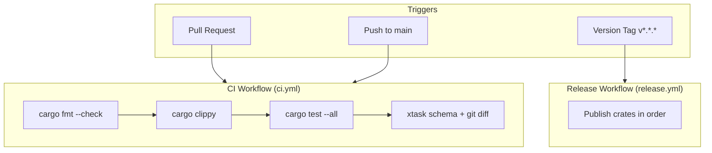

# Design Document: Release-Ready

## Overview

This design specifies the infrastructure, documentation, and testing needed to make builddiag release-ready for crates.io. The implementation focuses on GitHub Actions workflows for CI/CD, complete crate metadata, changelog management, expanded test coverage, and API documentation.

The design follows the existing project conventions: Rust 2024 edition, layered crate architecture, insta for snapshot testing, and assert_cmd for CLI integration tests.

## Architecture

### CI/CD Pipeline Architecture



### Crate Publishing Order

The release workflow must publish crates in dependency order to ensure each crate's dependencies are available on crates.io before it's published:

1. `builddiag-types` (no internal deps)
2. `builddiag-domain` (depends on types)
3. `builddiag-repo` (depends on domain, types)
4. `builddiag-checks` (depends on repo, domain, types)
5. `builddiag-render` (depends on types)
6. `builddiag-app` (depends on checks, repo, render, domain, types)
7. `builddiag` (CLI, depends on app, render, types)

## Components and Interfaces

### GitHub Actions Workflows

#### CI Workflow (`.github/workflows/ci.yml`)

```yaml
name: CI
on:
  push:
    branches: [main]
  pull_request:
    branches: [main]

jobs:
  check:
    runs-on: ubuntu-latest
    steps:
      - uses: actions/checkout@v4
      - uses: dtolnay/rust-toolchain@stable
      - uses: Swatinem/rust-cache@v2
      - name: Format check
        run: cargo fmt --all -- --check
      - name: Clippy
        run: cargo clippy --all-targets --all-features -- -D warnings
      - name: Test
        run: cargo test --all
      - name: Schema validation
        run: |
          cargo run -p xtask -- schema
          git diff --exit-code schemas/
```

#### Release Workflow (`.github/workflows/release.yml`)

```yaml
name: Release
on:
  push:
    tags: ['v*.*.*']

jobs:
  publish:
    runs-on: ubuntu-latest
    steps:
      - uses: actions/checkout@v4
      - uses: dtolnay/rust-toolchain@stable
      - name: Publish crates
        env:
          CARGO_REGISTRY_TOKEN: ${{ secrets.CARGO_REGISTRY_TOKEN }}
        run: |
          cargo publish -p builddiag-types
          sleep 30
          cargo publish -p builddiag-domain
          sleep 30
          cargo publish -p builddiag-repo
          sleep 30
          cargo publish -p builddiag-checks
          sleep 30
          cargo publish -p builddiag-render
          sleep 30
          cargo publish -p builddiag-app
          sleep 30
          cargo publish -p builddiag
```

### Crate Metadata Structure

Each crate's `Cargo.toml` needs these fields for crates.io:

```toml
[package]
name = "builddiag-types"
version = "0.1.0"
edition.workspace = true
license.workspace = true
description = "Shared types for builddiag build contract validator"
repository = "https://github.com/user/builddiag"
homepage = "https://github.com/user/builddiag"
readme = "README.md"
keywords = ["rust", "build", "validation"]
categories = ["development-tools"]
```

### CHANGELOG Format

Following keep-a-changelog format:

```markdown
# Changelog

All notable changes to this project will be documented in this file.

The format is based on [Keep a Changelog](https://keepachangelog.com/en/1.1.0/),
and this project adheres to [Semantic Versioning](https://semver.org/spec/v2.0.0.html).

## [Unreleased]

## [0.1.0] - YYYY-MM-DD

### Added
- Initial release
- MSRV validation checks
- Toolchain pinning checks
- Checksum verification checks
- Workspace resolver validation
- JSON report output
- Markdown summary output
- GitHub Actions annotations
```

### Test Structure

#### Unit Tests for Checks (`builddiag-checks`)

Each check function needs tests for:
- Success case (valid input produces no findings)
- Failure case (invalid input produces appropriate findings)
- Edge cases (missing files, malformed input)

```rust
#[cfg(test)]
mod tests {
    use super::*;
    use builddiag_types::Config;

    fn mock_repo_state() -> RepoState {
        // Create minimal RepoState for testing
    }

    #[test]
    fn msrv_defined_passes_when_present() {
        let repo = mock_repo_state_with_msrv("1.70.0");
        let config = Config::default();
        let report = check_msrv_defined(&repo, &config, Severity::Error).unwrap();
        assert_eq!(report.status, CheckStatus::Pass);
    }

    #[test]
    fn msrv_defined_fails_when_missing() {
        let repo = mock_repo_state_without_msrv();
        let config = Config::default();
        let report = check_msrv_defined(&repo, &config, Severity::Error).unwrap();
        assert_eq!(report.status, CheckStatus::Fail);
    }
}
```

### Documentation Structure

Doc comments follow Rust conventions:

```rust
/// Shared types for the builddiag build contract validator.
///
/// This crate provides the core data structures used throughout builddiag:
/// - [`Report`] - The main output structure containing all check results
/// - [`Config`] - Configuration schema for customizing check behavior
/// - [`Finding`] - Individual validation findings with severity and location

/// A single validation finding from a check.
///
/// # Examples
///
/// ```
/// use builddiag_types::{Finding, Severity};
///
/// let finding = Finding {
///     severity: Severity::Error,
///     code: "missing_msrv".to_string(),
///     message: "Missing rust-version in Cargo.toml".to_string(),
///     path: Some("Cargo.toml".to_string()),
///     line: None,
///     column: None,
/// };
/// ```
pub struct Finding { ... }
```

## Data Models

### Workflow Configuration Files

**CI Workflow** (`.github/workflows/ci.yml`):
- Triggers: push to main, pull requests to main
- Jobs: single `check` job with sequential steps
- Caching: Swatinem/rust-cache for cargo dependencies
- Steps: fmt, clippy, test, schema validation

**Release Workflow** (`.github/workflows/release.yml`):
- Triggers: tags matching `v*.*.*`
- Jobs: single `publish` job
- Authentication: CARGO_REGISTRY_TOKEN secret
- Sequential publishing with delays for crates.io index propagation

### Crate Metadata Fields

| Field | CLI Crate | Library Crates |
|-------|-----------|----------------|
| description | Required | Required |
| repository | Required | Required |
| homepage | Required | Required |
| readme | "README.md" | Optional |
| keywords | rust, cli, build, validation, msrv | rust, build, validation |
| categories | development-tools, command-line-utilities | development-tools |

### Test Coverage Matrix

| Crate | Check/Function | Test Type |
|-------|---------------|-----------|
| builddiag-checks | check_msrv_defined | Unit |
| builddiag-checks | check_msrv_consistent | Unit |
| builddiag-checks | check_toolchain_pinning | Unit |
| builddiag-checks | check_toolchain_msrv_relation | Unit |
| builddiag-checks | check_checksums_* (4 checks) | Unit |
| builddiag-checks | check_workspace_resolver | Unit |
| builddiag-repo | parse_checksums | Unit |
| builddiag-repo | parse_rust_toolchain_toml | Unit |
| builddiag-repo | load_workspace | Unit |


## Correctness Properties

*A property is a characteristic or behavior that should hold true across all valid executions of a system—essentially, a formal statement about what the system should do. Properties serve as the bridge between human-readable specifications and machine-verifiable correctness guarantees.*

Based on the prework analysis, the following properties are testable:

### Property 1: Crate Metadata Completeness

*For any* crate in the workspace, its `Cargo.toml` SHALL contain the required metadata fields: description, repository, homepage, keywords, and categories.

**Validates: Requirements 3.1, 3.2**

### Property 2: Check Pass Behavior

*For any* check function and any valid repository state that should pass validation, the check SHALL return a `CheckStatus::Pass` with no findings of severity `Error`.

**Validates: Requirements 5.1**

### Property 3: Check Fail Behavior

*For any* check function and any invalid repository state that should fail validation, the check SHALL return findings with non-empty `message` fields describing the issue.

**Validates: Requirements 5.2**

## Error Handling

### CI Workflow Errors

- **Format check failure**: Workflow fails with exit code, showing diff of formatting issues
- **Clippy warnings**: Workflow fails due to `-D warnings` flag, showing warning details
- **Test failures**: Workflow fails with test output showing which tests failed
- **Schema drift**: Workflow fails if `git diff --exit-code schemas/` detects changes

### Release Workflow Errors

- **Missing CARGO_REGISTRY_TOKEN**: Workflow fails with authentication error
- **Crate publish failure**: Workflow stops at failing crate, subsequent crates not published
- **Version conflict**: crates.io rejects if version already exists

### Documentation Errors

- **Missing doc comments**: `cargo doc` with `RUSTDOCFLAGS="-D warnings"` fails on undocumented public items

## Testing Strategy

### Dual Testing Approach

This feature uses both unit tests and property-based tests:

- **Unit tests**: Verify specific examples, edge cases, and error conditions for check implementations
- **Property tests**: Verify universal properties across generated inputs

### Unit Testing

Unit tests focus on:
1. **Check implementations** (`builddiag-checks`): Each of the 9 checks needs pass/fail test cases
2. **Repo parsing** (`builddiag-repo`): Parsing functions for checksums, toolchain files
3. **Workflow validation**: Verify YAML structure contains required elements

Example test structure for checks:

```rust
#[cfg(test)]
mod tests {
    use super::*;

    #[test]
    fn check_msrv_defined_passes_with_workspace_msrv() {
        // Arrange: RepoState with workspace_msrv set
        // Act: call check_msrv_defined
        // Assert: status is Pass, no error findings
    }

    #[test]
    fn check_msrv_defined_fails_without_msrv() {
        // Arrange: RepoState without workspace_msrv
        // Act: call check_msrv_defined
        // Assert: status is Fail, finding has message
    }
}
```

### Property-Based Testing

Property tests use the `proptest` crate to generate random inputs:

```rust
use proptest::prelude::*;

proptest! {
    #![proptest_config(ProptestConfig::with_cases(100))]

    /// Feature: release-ready, Property 2: Check Pass Behavior
    #[test]
    fn check_pass_returns_no_error_findings(
        msrv in "[0-9]+\\.[0-9]+\\.[0-9]+"
    ) {
        let repo = mock_repo_with_msrv(&msrv);
        let config = Config::default();
        let report = check_msrv_defined(&repo, &config, Severity::Error).unwrap();
        
        // Property: pass status means no error findings
        if report.status == CheckStatus::Pass {
            prop_assert!(report.findings.iter().all(|f| f.severity != Severity::Error));
        }
    }
}
```

### Test Configuration

- Property tests: minimum 100 iterations per property
- Each property test tagged with: `Feature: release-ready, Property N: {property_text}`
- Snapshot tests using `insta` for complex output verification

### Test Coverage Goals

| Component | Test Type | Coverage |
|-----------|-----------|----------|
| CI workflow YAML | Unit (structure validation) | Triggers, steps, caching |
| Release workflow YAML | Unit (structure validation) | Tag pattern, publish order |
| Cargo.toml metadata | Property | All 7 crates |
| Check functions (9) | Unit | Pass/fail cases each |
| Repo parsing | Unit | Valid/invalid inputs |
| Doc comments | Integration | `cargo doc` without warnings |
